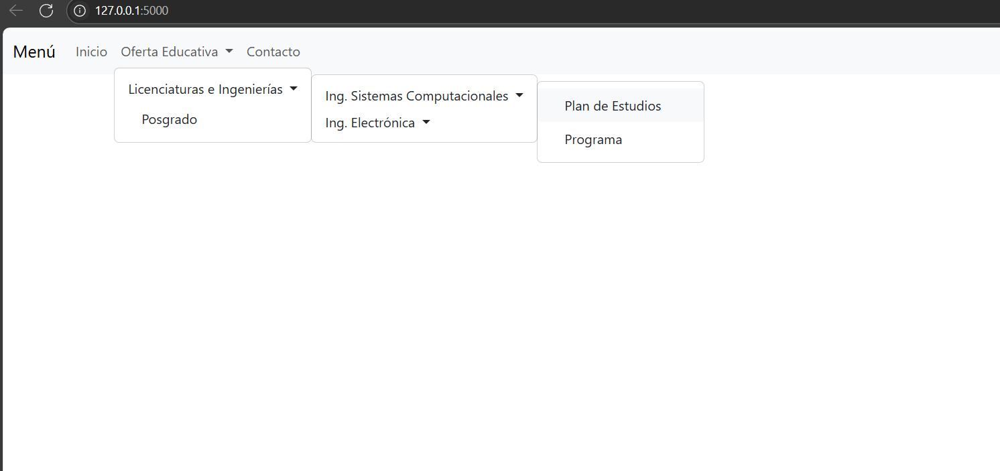

# DISEÑO DE MENU 

**Autor:** Joel Orozco joaquin

## Descripción
Este proyecto es una aplicación web sencilla desarrollada con Flask. Muestra un menú de navegación dinámico y responsivo, generado a partir de un diccionario anidado en Python y renderizado recursivamente en la plantilla HTML usando Jinja2. El diseño y la responsividad se logran con Bootstrap.

## Estructura de archivos
- `main.py`: Archivo principal de la aplicación Flask.
- `templates/menu.html`: Plantilla HTML con el menú dinámico.
- `README.md`: Este archivo.

## Requisitos
- Python 3.x
- Flask

## Instalación y ejecución
1. (Opcional) Crea y activa un entorno virtual:
   ```
   python -m venv venv
   venv\Scripts\activate  
   ```
2. Instala Flask:
   ```
   pip install flask
   ```
3. Ejecuta la aplicación:
   ```
   python main.py
   ```
4. Abre tu navegador y visita: [http://127.0.0.1:5000/](http://127.0.0.1:5000/)

## Especificaciones
- El menú de navegación se muestra en la parte superior de la página, como una barra horizontal.
- El menú es dinámico: se genera automáticamente a partir de un diccionario anidado en Python.
- Los submenús se despliegan al hacer clic o pasar el mouse, permitiendo navegar por varios niveles.
- El menú incluye las siguientes secciones principales: **Inicio**, **Oferta Educativa** (con submenús anidados) y **Contacto**.
- La aplicación es responsiva y se adapta a diferentes tamaños de pantalla gracias a Bootstrap.
- No se utiliza JavaScript personalizado, solo HTML, CSS y Bootstrap.

## Vista de ejemplo



## Notas
- El menú es completamente dinámico y soporta cualquier cantidad de subniveles.
- El diseño es responsivo gracias a Bootstrap (CDN).
